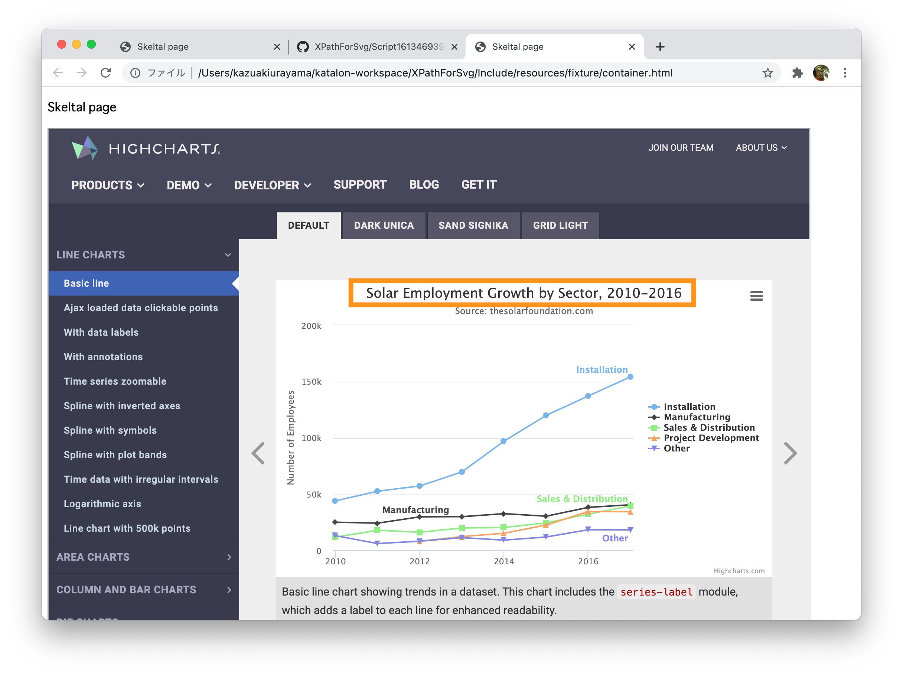

This project is a small Katalon Studio project, which proposes a solution to a question
raised at Katalon User Forum
[Katalon CSS/Xpath not working with SVG charts](https://forum.katalon.com/t/katalon-css-xpath-not-working-with-svg-charts/9155/8)

Just run "Test Cases/TC1". It will run successfull --- this means the XPath written in it works successfully.

TC1 opens a local HTML file which contains an `<iframe>`. The `<iframe>` opens an external web page https://www.highcharts.com/demo/line-basic. This page contains a `<svg>` node which shows a Line Chart. TC1 select the title of the SVG Chart and verifies the text using Katalon Studio's `WebUI.XXX` keywords.

A Good introduction to the XML Namespaces:

- https://developer.mozilla.org/en-US/docs/Web/SVG/Namespaces_Crash_Course
